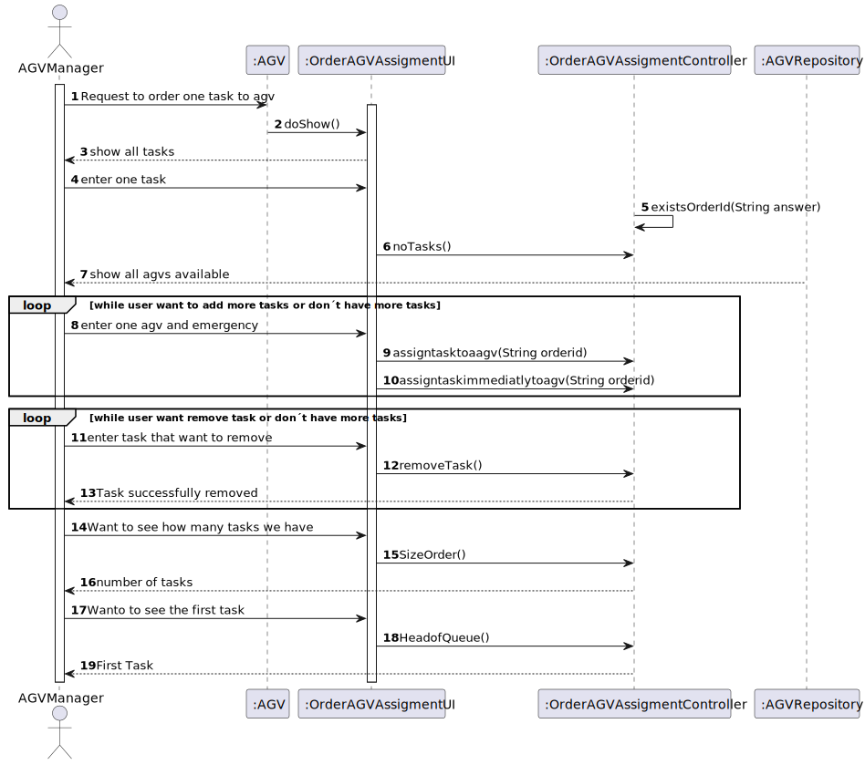
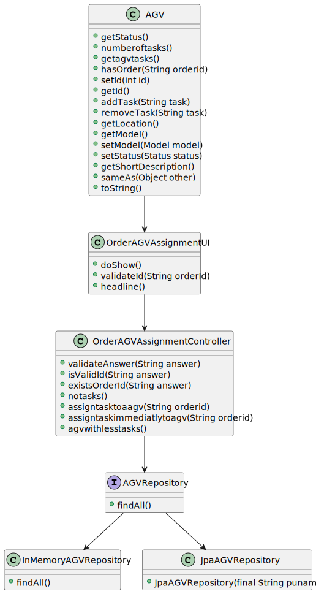

# US1501
=======================================

# 1. Requirements

**4002** As Project Manager, I want that the "AGVManager" component is enhanced with a basic FIFO algorithm to automatically assign tasks to AGVs.

- 4002.1. Main goal: Implement the FIFO  

- 4002.2. Functionalities: The user can remove, assign , verify all tasks and see the first task
- 4002.2. Dependencies: No dependencies

# 2. Analysis

- 1. **Concepts**: User with menu can choose remove, assign, showalltasks, and see the first task

- 2. **Organization**:The code has a UI that comunicates with the User and then sents the data received for a Controller. This Controller authenticates the User and sends the data to a Service.

- 3. **Code**:In terms of optimizing the code I opted to do a loop where the user can choose 4 options where remove the user only need the choose the number of the task, assign the user can choose the taskid and the id of the agv.Option showalltasks the user see alltasksavailable.And the option first task the user see the first task.

# 3. Design

## 3.1. Functionalities (SSD)

## 3.2. Class Diagram

## 3.3. Applied standards

*Nesta secção deve apresentar e explicar quais e como foram os padrões de design aplicados e as melhores práticas.*

## 3.4. Tests
*Nesta secção deve sistematizar como os testes foram concebidos para permitir uma correta aferição da satisfação dos requisitos.*

# 4. Implementation

*Nesta secção a equipa deve providenciar, se necessário, algumas evidências de que a implementação está em conformidade com o design efetuado. Para além disso, deve mencionar/descrever a existência de outros ficheiros (e.g. de configuração) relevantes e destacar commits relevantes;*

- When analysing the code it is possible to see how it is in accordance with the diagrams done for this US.

- Relevant commits:
  9d9497b

# 5. Integration/ Documentation

*Nesta secção a equipa deve descrever os esforços realizados no sentido de integrar a funcionalidade desenvolvida com as restantes funcionalidades do sistema.*

# 6. Observations

*Nesta secção sugere-se que a equipa apresente uma perspetiva critica sobre o trabalho desenvolvido apontando, por exemplo, outras alternativas e ou trabalhos futuros relacionados.*

